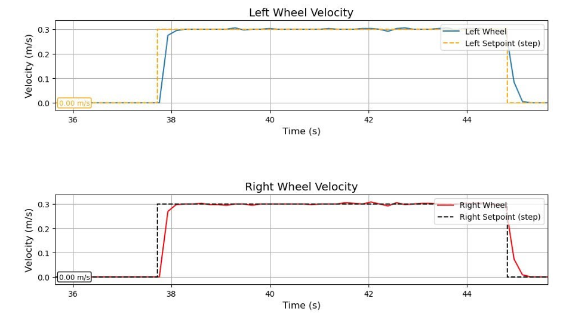

# A repo for DC servo motor controlling

This is a part of my Graduation project (Research and design of mobile robot for room cleaning).
In this project, I use a Blue pill F1 board to control 2 JGB37-520 motors (with two BTS 7960).

Method and funtions:
* C language, HAL functions, CubeMX and KeilC
* Using **External interrupt** to read signal form encoder, then calculating speed of wheels.
* Using PID algorithm to control velocity (PI parameters from DS method)
* Create **PWM** signal to control motors through BTS 7960
* UART communication (DMA/IT) with Raspberry Pi.
* Implement safety mechanism: ROS timeout, soft reset, shutdown when necessary; Optimize data transmission by DMA to reduce CPU load.

# [Click to see result](https://github.com/Phat-sv/DC_servo_motor_STM32/tree/main/images)

